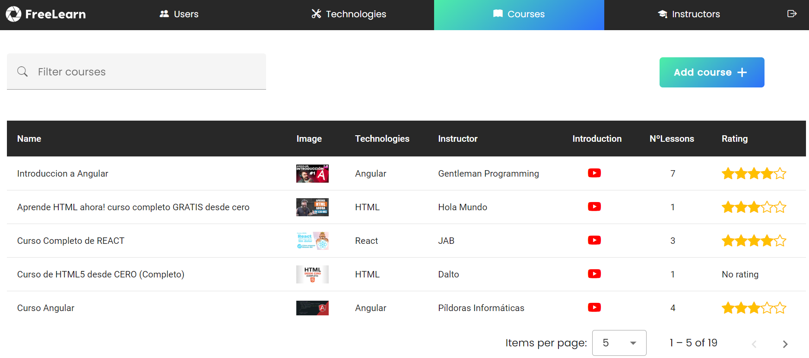
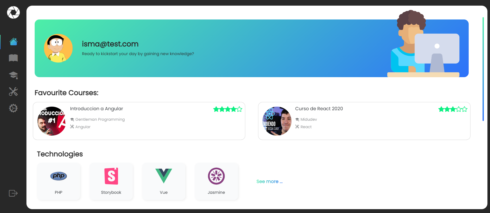
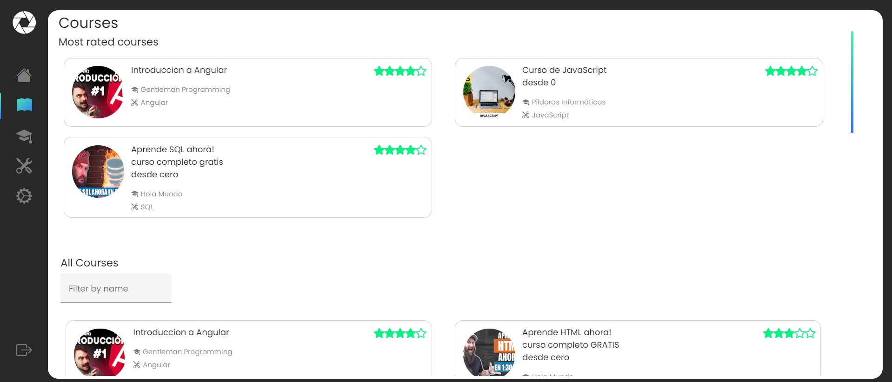
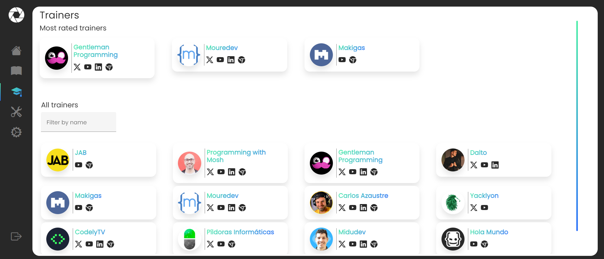
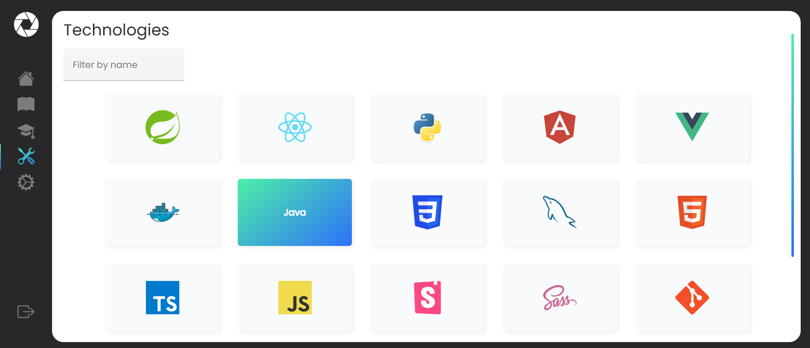
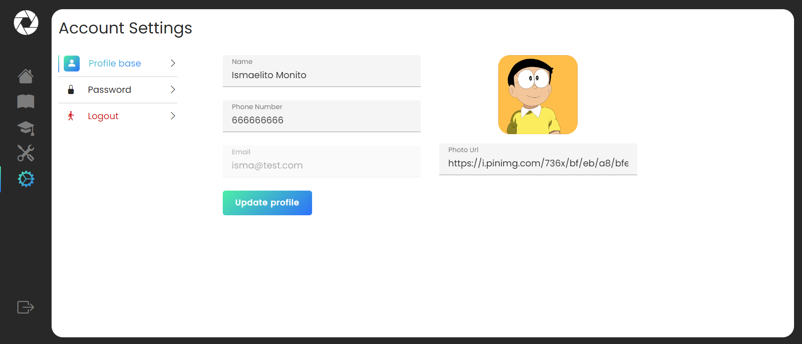

## 🌄 Overview
####  ⚙️ Admin Area

####  💻 Studen Area

### 🛠️ Built With

- [Angular 16](https://angular.io)
- [Firebase](https://firebase.google.com/?gad_source=1&gclid=Cj0KCQiAn-2tBhDVARIsAGmStVmMYgAr__GPGgeXgULyV4WMea_1PCr50mCbDr7pEPzS-NRJ_Pc0vrYaAmU3EALw_wcB&gclsrc=aw.ds)
- [NGRX](https://ngrx.io/)
- [Angular Material](https://material.angular.io/)
- [Boostrap](https://getbootstrap.com/)
- [Storybook](https://storybook.js.org/)
- [Sass](https://sass-lang.com/)

####  ✔️ Testing

- [Jasmine](https://jasmine.github.io/index.html)
- [Cypress](https://www.cypress.io/)

## 📝 Feature
This repository contains the source code of FreeLearn, a web application built with modern technologies such as Angular 16, Angular Material, NgRx, etc.

Freelearn is a learning platform designed to simplify the search and access to the best free technology courses available on YouTube. 
Our goal is to make it easy for users to discover relevant educational content without having to navigate through thousands of options.

Key Features:
- __Content:__ We carefully select YouTube courses that provide quality information on various technologies. This ensures that users find relevant and up-to-date courses.
- __Detailed Information:__ We provide details about the instructors, allowing users to learn more about the voices behind the courses. Additionally, we offer links to their social media or personal websites, giving users the option to access them directly.
- __Administration Area:__ Administrators have an easy-to-use interface to manage and keep the course catalog updated. They can add new courses, update information, and ensure the quality of the presented content.
- __Student Area:__ Users have access to an intuitive, straightforward, and personalized space where they can modify their user data, review instructor profiles, explore available technologies and courses, watch lessons directly on the platform, and mark their favorite courses.

## 🚀 Development server

Run `ng serve -o` for a dev server. Navigate to `http://localhost:4200/`. The application will automatically reload if you change any of the source files.

## ⌨️ Code scaffolding

Run `ng generate component component-name` to generate a new component. You can also use `ng generate directive|pipe|service|class|guard|interface|enum|module`.

## 📦 Build

Run `ng build` to build the project. The build artifacts will be stored in the `dist/` directory.

## ✅ Running unit tests

Run `ng test` to execute the unit tests via [Karma](https://karma-runner.github.io).

## ☑️ Running end-to-end tests

Run `ng e2e` to execute the end-to-end tests via a platform of your choice. To use this command, you need to first add a package that implements end-to-end testing capabilities.

## ❓ Further help

To get more help on the Angular CLI use `ng help` or go check out the [Angular CLI Overview and Command Reference](https://angular.io/cli) page.
